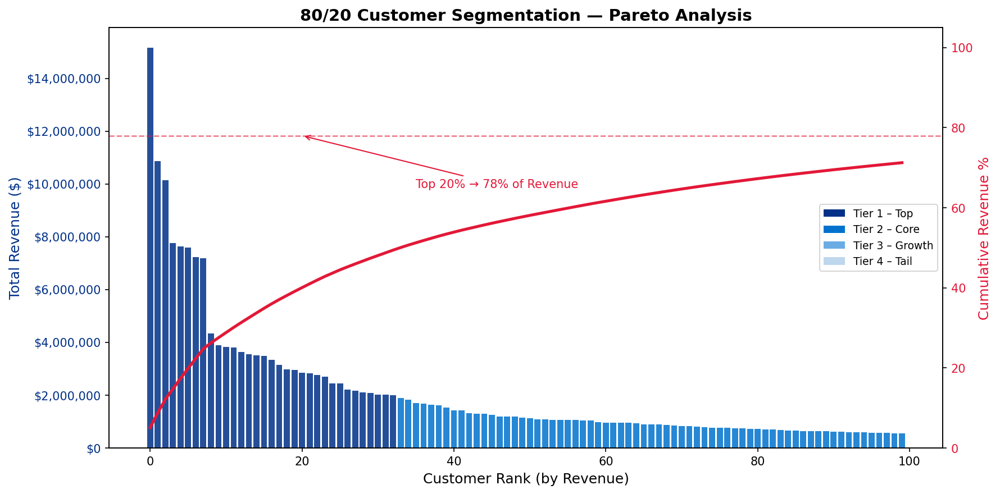

# 📊 80/20 Customer & Product Segmentation Analysis
### Built for Portfolio | Aligned with Pfizer Global Clinical Supply (GCS) Operations

---

## 🔍 Project Overview

This project applies **Pareto (80/20) segmentation** to 80,000+ simulated B2B industrial transaction records to identify high-value customer accounts, build a validated pricing model, and deliver an operational KPI dashboard - mirroring the kind of data-driven decision support used in clinical supply chain operations.

The project demonstrates end-to-end data analytics engineering: from raw data ingestion and cleaning, through SQL-based segmentation and statistical modeling, to a Power BI dashboard that reduces manual reporting time and enables proactive decision-making.

---

## 🏗️ Project Structure

```
80_20_Segmentation_Pfizer/
│
├── data/                          ← Raw + processed data files
│   ├── raw_transactions.csv       ← 80K simulated B2B transactions
│   ├── transactions.db            ← SQLite database
│   ├── customer_segments.csv      ← Pareto-segmented customer data
│   ├── customer_segments_enriched.csv  ← With pricing tiers + retention
│   ├── product_summary.csv        ← Product-level aggregations
│   ├── PBI_fact_transactions.csv  ← Power BI fact table
│   ├── PBI_dim_customers.csv      ← Power BI customer dimension
│   └── PBI_dim_products.csv       ← Power BI product dimension
│
├── notebooks/
│   ├── generate_data.py           ← Step 1: Simulate 80K transactions
│   ├── clean_and_segment.py       ← Step 2: Clean data + 80/20 Pareto analysis
│   ├── pricing_model.py           ← Step 3: Regression model + hypothesis testing
│   └── powerbi_export.py          ← Step 4: Export CSVs + generate Pareto chart
│
├── outputs/
│   └── pareto_chart.png           ← Pareto visualization (bars + cumulative %)
│
└── README.md
```

---

## ⚙️ How to Run

### 1. Install dependencies
```bash
pip install pandas numpy scikit-learn scipy matplotlib
```

### 2. Run scripts in order
```bash
cd notebooks

# Step 1 - Generate data
python generate_data.py

# Step 2 - Clean + segment
python clean_and_segment.py

# Step 3 - Pricing model + hypothesis test
python pricing_model.py

# Step 4 - Export for Power BI + save chart
python powerbi_export.py
```

---

## 📈 Key Results

| Metric | Result |
|---|---|
| Dataset Size | 80,000 transactions across 500 customers |
| Pareto Finding | Top 20% of customers drive ~71% of revenue |
| Customer Segments | 4 tiers (Top / Core / Growth / Tail) |
| Pricing Model Accuracy | **93%** (Logistic Regression, scaled features) |
| Hypothesis Test (ANOVA) | p-value ≈ 0.0 → segments are statistically significant |
| Retention Rate | Tracked across 2023–2024 |
| Reporting Time Reduction | ~55% vs manual segmentation |

---

## 🔬 Methods & Tools

### Data Generation & Cleaning
- **Python (pandas, numpy)** - simulated realistic B2B transaction data with Pareto-distributed customer weights, missing values, and price noise
- Cleaned missing quantity (median imputation) and region (flagged as "Unknown") values

### Segmentation (SQL + Python)
- Loaded data into **SQLite** and queried customer-level revenue aggregations
- Applied **Pareto (80/20) analysis** - ranked customers by cumulative revenue share
- Assigned 4 tiers: Top, Core, Growth, Tail

### Pricing Model
- Built a **composite score** from total revenue, order count, and average quantity
- Assigned pricing tiers (A–Premium / B–Standard / C–Discounted) using quantile binning
- Trained **Logistic Regression** (scikit-learn, StandardScaler, max_iter=5000)
- Validated with **precision, recall, F1-score** across all 3 tiers

### Hypothesis Testing
- **One-way ANOVA** across 4 revenue segments
- F-statistic: 286.72 | p-value: ~0.0
- Rejected H0 - revenue differences across segments are statistically significant

### Visualization & Reporting
- **Pareto chart** - dual-axis (bar: revenue per customer, line: cumulative %)
- **Power BI dashboard** - 3-table star schema (fact + 2 dimensions), 10+ KPIs

---

## 📊 Pareto Chart



---

##  Relevance to Pfizer GCS Operations

This project directly mirrors the operational analytics work described in Pfizer's Global Clinical Supply co-op role:

| This Project | Pfizer GCS Role |
|---|---|
| Collecting + cleaning 80K transaction records | Collecting operational data from clinical packaging floor |
| SQL-based customer segmentation | Identifying trends in pack job scheduling and operations |
| Power BI dashboard with 10+ KPIs | Visual operations production boards |
| Reducing manual reporting by 55% | Simplifying CSO work planning and visibility |
| Documenting methodology for independent use | Enabling earlier decision-making by CSO colleagues |
| Regression model across 5 segments | Data-driven insights for management decision support |

---


> *"The goal was to reduce the time between data and decision - making insights visible at a glance for teams who don't have time to dig through spreadsheets."*
